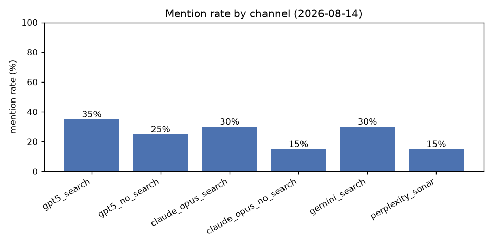

# Baseline 리포트 (2026-08-14)

## 측정 대상
- 매장: 온기국밥 홍대점 (한식/돼지국밥)
- 프롬프트: 20개
- 채널: 6개 (LLM × 검색 on/off)
- 모드: mock

## 결과 요약
- **총 120 조합 중 매장 언급: 30회 (25.0%)**
- 언급된 프롬프트: 18/20개
- 감성 분포: positive 7, neutral 23
- 오류: 0건

## 채널별 상세
| 채널 | 언급 | 측정 | 언급률 | 언급 시 평균 순위 |
|---|---|---|---|---|
| gpt5_search | 7 | 20 | 35.0% | 3.9 |
| gpt5_no_search | 5 | 20 | 25.0% | 4.0 |
| claude_opus_search | 6 | 20 | 30.0% | 2.5 |
| claude_opus_no_search | 3 | 20 | 15.0% | 3.7 |
| gemini_search | 6 | 20 | 30.0% | 3.5 |
| perplexity_sonar | 3 | 20 | 15.0% | 5.0 |

## 검색 순위 (자기 매장 도메인)
| 쿼리 | 매장 도메인 순위 |
|---|---|
| q_hongdae_general | 10위권 밖 |
| q_hongdae_top | 10위권 밖 |
| q_hongdae_korean | 10위권 밖 |
| q_hongdae_gukbap | 10위권 밖 |
| q_hongdae_gukbap_en | 10위권 밖 |
| q_hongdae_date | 10위권 밖 |
| q_hongdae_solo | 10위권 밖 |
| q_hongdae_group | 10위권 밖 |
| q_hongdae_cheap | 10위권 밖 |
| q_hongdae_late | 10위권 밖 |
| q_hongdae_local_pick | 10위권 밖 |
| q_hongdae_lunch | 10위권 밖 |
| q_hongdae_traditional | 10위권 밖 |
| q_hongdae_soup | 10위권 밖 |
| q_hongdae_tourist_en | 10위권 밖 |
| q_hongdae_hangover | 10위권 밖 |
| q_mapo_gukbap | 10위권 밖 |
| q_hongdae_family | 10위권 밖 |
| q_hongdae_rainy | 10위권 밖 |
| q_hongdae_best_overall | 10위권 밖 |

## 인용된 소스 도메인 TOP 10
| 도메인 | 인용 횟수 |
|---|---|
| blog.naver.com | 80 |
| mangoplate.com | 80 |
| siksinhot.com | 80 |

## 다음 액션
- **P0**: 검색 상위 10위 안에 매장 도메인이 전혀 없음 — 랜딩 페이지 SEO (title/H1에 '지역+카테고리 맛집' 키워드) 보강 필요
- **P1**: LLM들이 인용하는 상위 소스(blog.naver.com, mangoplate.com, siksinhot.com)에 매장 콘텐츠 확보
