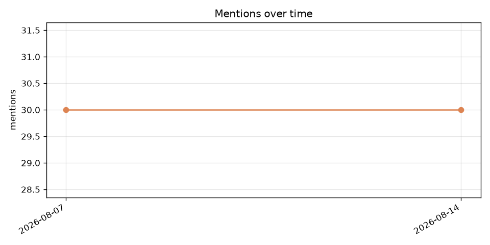

# 주간 리포트 (2026-08-14, 비교 기준: 2026-08-07)

## 요약
- 총 언급: **30회** (지난 주 30회, ―)
- 언급률: 25.0% (지난 주 25.0%)
- 언급된 프롬프트 수: 18 (지난 주 18)

## 처음 언급된 프롬프트
_새로 언급된 프롬프트 없음_

## 채널별 언급 변동
| 채널 | 이번 주 | 지난 주 | 변동 |
|---|---|---|---|
| claude_opus_no_search | 3 | 3 | ― |
| claude_opus_search | 6 | 6 | ― |
| gemini_search | 6 | 6 | ― |
| gpt5_no_search | 5 | 5 | ― |
| gpt5_search | 7 | 7 | ― |
| perplexity_sonar | 3 | 3 | ― |

## 검색 순위 변동 (자기 매장 도메인)
| 쿼리 | 이번 주 순위 | 지난 주 순위 | 변동 |
|---|---|---|---|
| q_hongdae_best_overall | - | - | ― |
| q_hongdae_cheap | - | - | ― |
| q_hongdae_date | - | - | ― |
| q_hongdae_family | - | - | ― |
| q_hongdae_general | - | - | ― |
| q_hongdae_group | - | - | ― |
| q_hongdae_gukbap | - | - | ― |
| q_hongdae_gukbap_en | - | - | ― |
| q_hongdae_hangover | - | - | ― |
| q_hongdae_korean | - | - | ― |
| q_hongdae_late | - | - | ― |
| q_hongdae_local_pick | - | - | ― |
| q_hongdae_lunch | - | - | ― |
| q_hongdae_rainy | - | - | ― |
| q_hongdae_solo | - | - | ― |
| q_hongdae_soup | - | - | ― |
| q_hongdae_top | - | - | ― |
| q_hongdae_tourist_en | - | - | ― |
| q_hongdae_traditional | - | - | ― |
| q_mapo_gukbap | - | - | ― |

## 인용 소스 변화
- 새로 등장한 도메인: 없음
- 사라진 도메인: 없음
